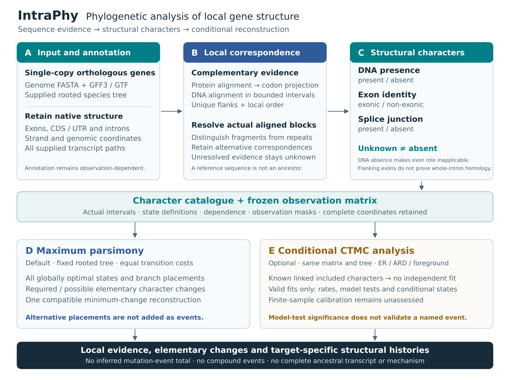

# IntraPhy

**Phylogenetic analysis of gene structure · version 0.18.0**

IntraPhy compares gene-internal structure in a supplied set of **single-copy
orthologous genes**. It combines local sequence correspondence, existing
annotation and a rooted species tree to reconstruct **structural character
changes**. The three observation layers describe homologous DNA presence,
annotation-conditional exon identity and splice junctions at corresponding
positions.



*Figure 1. Sequence evidence is converted into explicit structural characters
before phylogenetic reconstruction. Original genomic coordinates and supplied
transcript paths are retained. Alternative minimum-change placements are not
added together. Known character dependence blocks the independent-character
likelihood analysis. [Figure source and rendering](docs/figure.md).*

## Install

Python 3.10 or later is required. Install MAFFT and minimap2 separately; they are
real external programs, not Python packages. On Ubuntu:

```bash
sudo apt-get update
sudo apt-get install -y mafft minimap2
python3 -m venv .venv
source .venv/bin/activate
python -m pip install -c requirements-ci.txt .
intraphy --version
intraphy inspect-aligners
```

The executable, import package and module entry point are all named `intraphy`.
Version 0.18 removes the previous package and executable aliases.
See [installation](docs/installation.md) for optional miniprot, supported
versions and clean-install checks.

## Run a complete raw-input example

This four-taxon **synthetic** example starts with genome FASTA, GFF3 and Newick.
It does not supply inferred homology or an observation matrix. The default
example contains an additional intron in Taxon_D; the reference is not assumed
to be ancestral.

```bash
intraphy example --output-dir example
intraphy check --manifest example/manifest.tsv --species-tree example/species_tree.nwk
intraphy build-case \
  --manifest example/manifest.tsv \
  --species-tree example/species_tree.nwk \
  --output-dir work/example --threads 2
intraphy run --input-dir work/example --output-dir results/example --threads 2
intraphy visualize \
  --input-dir work/example --result-dir results/example \
  --output-dir figures/example
```

Open `figures/example/index.html` to inspect the target-specific figures.
The example tests implementation behavior, not biological accuracy or statistical
calibration. `--scenario conserved` and `--scenario annotation_dropout` provide
additional raw-input controls.

## Use your own data

Provide one row per species and gene family in a tab-separated manifest:

```text
species	family_id	gene_id	genome_fasta	annotation_file
Species_A	OG0001	gene_A	genomes/A.fa	annotations/A.gff3
Species_B	OG0001	gene_B	genomes/B.fa	annotations/B.gff3
```

Paths are resolved relative to the manifest. The rooted Newick or TSV tree must
use the same species labels. All supplied transcript paths are retained by
default. Gene orthology is an upstream input; IntraPhy does not infer it.
An [OrthoFinder import](docs/input_format.md) is also available.

Run `intraphy COMMAND --help` for command-specific options. Nonempty output
directories are refused. `--force` preserves an identifiable previous IntraPhy
output as a timestamped backup; it does not silently mix old and new results.
Each primary command writes `intraphy.log`, `environment.json` and
`execution.json`. See [command-line use](docs/cli.md).

## Read the principal results

| Output | Meaning |
|---|---|
| `character_catalogue.tsv` | Character identity, state definition, counting unit and dependence metadata |
| `character_coordinates.tsv` | Actual aligned intervals or projected splice positions |
| `structural_site_matrix.tsv` | Complete frozen observation matrix, including unknown and inapplicable entries |
| `structural_character_eligibility.tsv` | Known 0/1 coverage, observed species and phylogenetic coverage |
| `branch_structural_events.tsv` | Elementary character changes supported in all or some minimum-change histories |
| `gene_change_summary.tsv` | Minimum changes per family and layer; no inferred mutation-event total |
| `minimum_change_history.tsv` | One globally compatible optimum, explicitly not a probability sample |
| `ancestral_state_consistency.tsv` | Applicability conflicts among separately reconstructed layers |

A junction gain can be described as an exon split without counting a second
event. Several cutpoints remain several characters; there is no formal compound
event summary. A single mutation can affect multiple characters, and a single
character can change repeatedly. [Counting rules](docs/event_counting.md).

## Optional likelihood analysis

Maximum parsimony is the default. ER/ARD and foreground CTMC comparisons must
reuse the same frozen matrix:

```bash
intraphy infer-phylogeny \
  --input-dir work/example \
  --structural-site-matrix results/example/structural_site_matrix.tsv \
  --output-dir results/example_erard --model er-ard
```

Known linked characters jointly included in a family-layer block the independent
CTMC fit, AIC, intervals, model test and posterior output. Other invalid or
uninformative fits also remain unavailable with explicit reasons. A model-test
P value compares rate models; it does not establish a particular historical
event. Finite-sample calibration remains unassessed.
[Statistical assumptions](docs/statistical_model.md).

## Scientific scope

An unaligned interval is not automatically absent. Corresponding flanking exons
do not establish homology of every nucleotide in the intervening intron.
Annotated repertoire presence does not measure tissue-specific transcript use.
The formal model does not reconstruct complete ancestral transcripts, exon
shuffling mechanisms, complex rearrangements, gene duplication histories,
selection or phenotypic causes. [Detailed scope and 28 cases](docs/scope_policy.md).

## Documentation and development

[Method](docs/method.md) · [Architecture](docs/architecture.md) ·
[Inputs](docs/input_format.md) · [Outputs](docs/outputs.md) ·
[Migration](docs/MIGRATION_0.18.md) · [Validation](docs/validation.md) ·
[References](docs/references.md)

```bash
python tools/check_source_layout.py
python -m unittest discover -s tests -v
python -m build
```

Historical v16/v17 logs and demo outputs remain historical evidence. They are
not v18 biological validation. Current validation records distinguish unit tests,
real-executable integration tests, synthetic raw inputs and unperformed
statistical or biological validation. See `CITATION.cff` and the MIT license.
