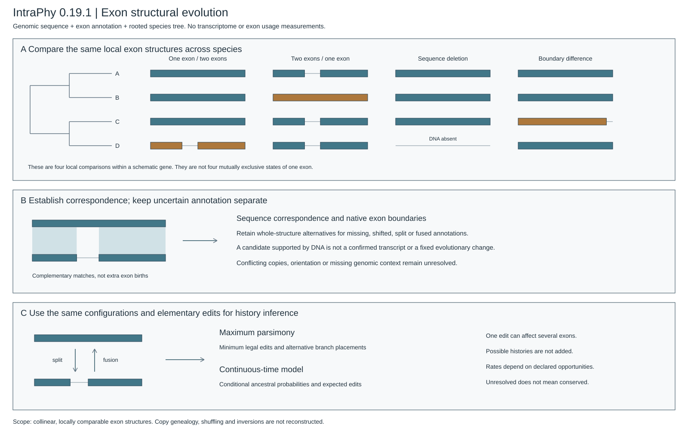

# IntraPhy

**Exon structural evolution from genomes and annotations — version 0.19.1**

IntraPhy compares **single-copy orthologous gene loci** using genomic FASTA,
GFF3/GTF and a rooted species tree. It reconstructs local exon structures and
possible histories of their changes. It does **not** require RNA-seq and does not
estimate exon usage, PSI, differential splicing, expression or selection.



**0.19.1 fixes the V19 audit regressions.** Whole-structure annotation alternatives,
full available locus searches, shared physical-region validation, canonical tree
branches, source-supported module insertion, weighted gene bootstrap and distinct
CTMC figures are implemented. [Audit-to-code map](docs/v0191_audit_resolution.md).

## What is a V19 model state?

One state is the **ordered configuration of one exon or a dependent group of
exons**: their boundaries and the sequence material needed to distinguish deletion
from retained-but-unannotated sequence. An ancestral exon may correspond to two
exons; two exons may correspond to one. Alignment fragments are not extra events.

Elementary changes are split, fusion, donor/acceptor shift, exon appearance or
inactivation on retained sequence, and source-aware interval insertion/deletion.
A deletion affecting two exons is one interval edit in that explanation, not two
independent losses. A split is not additionally counted as intron gain.
**Structural edit counts are not identified molecular mutation counts.**

V19 uses a new configuration schema and engine. The older independent
DNA/exonic-status/junction analyses remain **explicit legacy baselines**, not the
new model under a different name. See [model and assumptions](docs/exon_structure_model.md),
[implementation map](docs/v0191_audit_resolution.md), and [validation scope](docs/v0191_validation.md).

## Install

Python 3.10+, MAFFT and minimap2 are required for raw inputs. For example, on Ubuntu:

```bash
sudo apt-get update
sudo apt-get install -y mafft minimap2
unzip IntraPhy_v0.19.1_source.zip
cd IntraPhy-v0.19.1
python3 -m venv .venv
source .venv/bin/activate
python -m pip install -c requirements-ci.txt .
intraphy --version
intraphy inspect-aligners
```

The CI reference environment is Ubuntu 24.04 with MAFFT 7.505, minimap2 2.26,
and Python 3.10 / 3.13. External tools are not silently replaced when unavailable.
CairoSVG is optional for PNG previews. CESAR2 and AGAT are optional, explicit
adapters; neither is required for the standard route.

## One command from genomic FASTA, GFF and a tree

For one selected gene per species:

```text
loci/
    Species_A.fa       Species_A.gff3
    Species_B.fa       Species_B.gff3
    Species_C.fa       Species_C.gff3
species_tree.nwk
```

```bash
intraphy check --fasta loci/ --gff loci/ --species-tree species_tree.nwk
intraphy analyze --fasta loci/ --gff loci/ --species-tree species_tree.nwk \
    --output-dir results/my_gene --threads 8
intraphy visualize --input-dir results/my_gene/prepared_inputs \
    --result-dir results/my_gene --output-dir figures/my_gene
```

File stems identify species and must match tree tips. FASTA must contain
**continuous genomic DNA** in the coordinate system used by the GFF. A spliced
CDS or protein sequence cannot supply introns or flanking genomic sequence.

For whole-genome inputs, select upstream ortholog families using FASTA identifiers:

```bash
intraphy analyze --fasta genomes/ --gff annotations/ \
    --orthologs orthologs/ --species-tree species_tree.nwk \
    --output-dir results/families --threads 8
```

Each ortholog FASTA identifies one family. Explicit gene/transcript/protein IDs
select the GFF locus; its sequence may be coding/protein but is not used as
substitute genomic DNA. Orthology itself is an upstream requirement. No hand-made
manifest is required. The program writes its resolved target table for provenance.
A selected gene-only GFF locus remains unknown in `analyze`; the gene span is not
turned into an exon. A completely missing gene locus cannot be inferred from a
missing input file.

Automatic flanks (`--flank`, `--max-extension`) use available genomic sequence;
truncation is recorded. Portable paired FASTA/GFF export remains available through
`extract-loci`. See [file input details](docs/inputs.md).

## Read the results

| File | Meaning |
|---|---|
| `exon_correspondence.tsv` | Native exon identity, actual comparison coordinates, support and ambiguity |
| `annotation_structure_candidates.tsv` | Predicted-only exon/boundary alternatives, kept separate from annotation |
| `exon_configurations.jsonl` | Versioned observation catalogue, material provenance and coordinate scope |
| `structural_history.tsv` | Elementary edits compatible with optimal histories; required/possible, not additive possibilities |
| `representative_structural_history.tsv` | One explicitly conditional, jointly compatible history per scenario |
| `exon_structure_summary.tsv` | Per-local-configuration status, observation sensitivity and minimum edits |
| `gene_structure_summary.tsv` | Resolved/unresolved scope and minimum edits within resolved local units |
| `exon_history.json` | State catalogue and detailed scenario results |
| `model_diagnostics.json` | State-space completeness, assumptions, probability availability and limitations |
| `native_cds_consequences.json` | Actual transcript-specific CDS and coding consequences, never an ORF filter |

The default `--observation-view evidence` permits sequence-supported annotation
alternatives. The `annotation` view asks what follows **if the supplied boundaries
are correct**. Both are reported. A boundary difference or missing GFF exon may
therefore imply a change in the annotation-conditional analysis but no required
change in the evidence-compatible analysis. This distinction is intentional.

True coexisting annotations are separate conditional scenarios, not a mixture
with inferred usage weights. Large repeats, inversions, unresolved homology,
ambiguous overlapping indels and exhausted candidate spaces are explicitly
unresolved; a missing event is not proof of conservation.

## Optional finite-state probability calculation

Maximum parsimony is the default. The new CTMC uses the **same configurations and
allowed edits**, not a legacy binary table. It needs explicit edit-rate parameters:

```bash
# Illustrative parameters only: this command does not estimate biological rates.
intraphy exon-rate-template --output example_rates.json --rate 0.1
intraphy infer-phylogeny --input-dir results/my_gene \
    --exon-configurations results/my_gene/exon_configurations.jsonl \
    --model exon-ctmc --exon-rates example_rates.json --expected-edits \
    --output-dir results/my_gene_ctmc
```

Output distinguishes ancestral configuration probabilities, different endpoints,
at least one edit, and expected edit counts. `--expected-edits` is optional because
marked-matrix integrals can be expensive. Re-reading a **0.19.1** catalogue requires no
aligner and does not silently rebuild observations. 0.19.0 catalogues must be
regenerated from their original FASTA/GFF/tree or explicit biological specification;
the schema is now `intraphy.exon-configurations/2`. Do not relabel an old file.

Probability is conditional on the sequence correspondence, annotation view,
finite candidate catalogue, explicit root/origin assumptions, tree and rates.
State-space exhaustion blocks probabilities; it is not fixed by renormalization.
Unobserved non-root unary tree nodes are collapsed, preserving total branch lengths.
Original-to-normalized edge mapping is saved in `tree_normalization.json`.
`--origin-root-sensitivity 0.25 4` requests additional, explicitly conditional
sensitivity runs for alternative root-opportunity weights. These are not a model
selection exercise and do not implement continuous-time Dollo immigration.
The default origin-opportunity prior is explicit in the model document. This is
not a fitted joint model of annotation error, homology and sequence evolution.

## Pooled rate estimation and conditional model comparisons

`fit-exon-rates` estimates a **shared scale** on explicitly fixed relative edit
rates across a declared set of independent genes. It does not fit eight free
rates to a gene with a few exons. Optional bootstrap resamples whole genes,
retaining all local units and failed draws. Foreground comparison estimates one
additional multiplier and does not diagnose a mutation mechanism or selection.

```bash
intraphy fit-exon-rates --exon-configurations results/families/exon_configurations.jsonl \
    --species-tree results/families/species_tree.tsv --exon-rates example_rates.json \
    --gene-bootstrap 100 --output-dir results/rate_fit
```

The automatically discovered catalogue is **not genome-wide calibrated**. The
foreground wrapper never emits an asymptotic P value. Conditional Monte Carlo
P values require an independently declared complete catalogue, compatible masks,
valid fits and valid refits for every requested simulation. Do not relabel a
discovered catalogue as independent merely to obtain a P value.

## Reproduce a structural example

```bash
intraphy example-exons --scenario fusion_phase1 --output-dir example_raw
intraphy analyze --fasta example_raw/ --gff example_raw/ \
    --species-tree example_raw/species_tree.nwk --output-dir example_result
intraphy explain --output-dir model_guide
```

`example-exons --help` lists 20 raw structural/observation-damage scenarios.
The analysis never reads their separate truth file. The `intronization` example
changes annotation only: its annotation-condition history is one split, while the
evidence-condition retains a whole-exon alternative. It is not a biological
intronization validation. Nine extra raw audit cases include signal-changing
controls, terminal annotation dropouts and an exact exon deletion.

`intraphy explain` generates three current scientific plates plus an architecture
plate, with computed example histories, parameters and separate parsimony/CTMC
result figures. PNG previews require `pip install cairosvg` and `--png`.
The static SVG/PNG versions are in [docs/figures](docs/figures/index.html).
Old binary-layer figures are explicitly archived under `docs/figures/legacy_v018/`.

```bash
python tools/check_source_layout.py
python -m unittest discover -s tests -v
python tools/validate_v19.py --output-dir validation/current/v19-raw
python tools/validate_v0191.py --output-dir validation/current/v0191-audit
python tools/smoke_validate.py --output-dir validation/current/wheel-smoke
```

Tests and synthetic scenarios are implementation checks, **not independent
biological benchmarking or validated operating characteristics**. Real-case
benchmarks and discovery-aware calibration remain necessary for a methods paper.

## Optional adapters and legacy analyses

`normalize-annotation` explicitly invokes AGAT and records its outputs. It does
not turn annotation repair into independent validation. `realign-exons` exports
and executes CESAR2 gene-mode input with explicitly chosen profiles and codon
matrix. Its prediction remains separate and is never automatically promoted to a
confirmed exon or substituted into the primary history.

The old `run --model parsimony`, `er-ard`, `foreground` models and
`explain --legacy-v18` are documented historical baselines. V19 defaults are
`exon-parsimony` and `exon-ctmc`; legacy-only flags are rejected in those models.
The removed former package name and executable alias are not restored.

## Practical limits and supplied source modules

The default finite-state cap is 1024. An exact geometry-count preflight and a
material-state upper bound are saved; four adjacent exons with three variable
spacers (the audit case) now enumerate all 556 states. Sparse shortest paths and
bounded run-local CTMC kernel reuse reduce unnecessary work. This does not remove
combinatorial growth: over-budget catalogues still stop, without truncation and
renormalization. Only states in the declared finite catalogue are modeled.

A multi-exon insertion can be one edit **only with an explicit source-supported
`insertion_payloads` entry**. This is a conditional input, not automatic discovery
of exon shuffling or copy genealogy. See the model specification for the schema.
Mere appearance of several exons does not qualify them as one inserted module.

Files in this local distribution are not evidence of a GitHub release. Installation
from the supplied source/wheel does not require pushing or modifying a repository.
