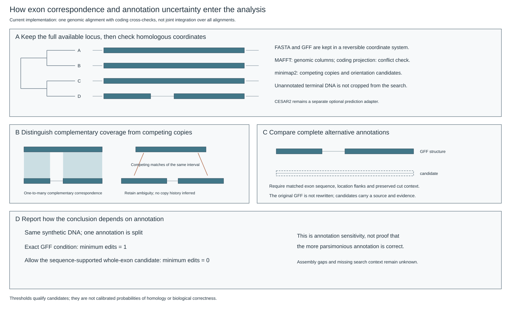
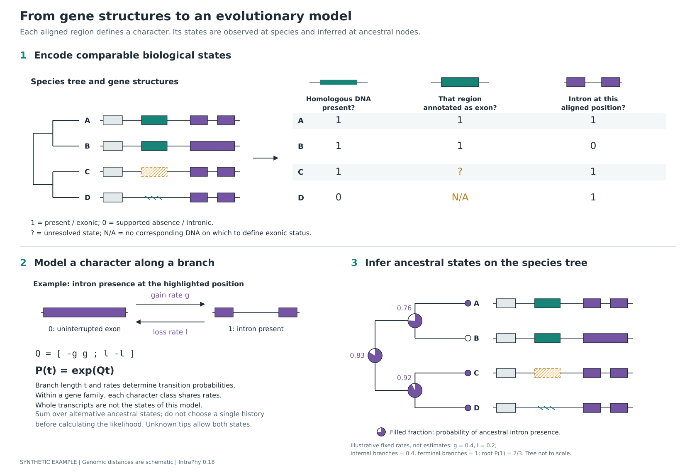

# A biological explanation in three figures

Read the overview first. The algorithm and probability-model figures provide
separate levels of detail rather than packing six unrelated panels into one image.

## 1. Overview


The same four-species gene family is shown before and after the biological
questions are defined. Teal denotes the central homologous DNA segment; purple
denotes exonic sequence around a different intron position. Species C has a DNA
match but no informative exon annotation for the central segment; D has supported
absence of that segment. B lacks the purple intron. Dashed boxes are candidates,
not confirmed exons. The tree's illustrative minimum-change placements contain
a DNA loss and a separate intron loss. The method is not specific to splitting.

## 2. Homology and incomplete annotation



Protein alignments are projected to genomic coordinates. Nucleotide alignments
also search the available DNA not already annotated as exons. Unique flanking
matches delimit short realignments. Compatible sequence matches form an ordered
chain; best and near-optimal paths are retained. Complementary intervals can
correspond across a split/fused exon without deciding evolutionary direction.
Repeated coverage produces competing correspondences, not automatic extra events.

A missing annotation has multiple outcomes: supported DNA with unknown exonic
status, supported DNA deletion, or unresolved evidence. An informative annotated
transcript can instead support a non-exonic state. The figures do not imply that
sequence evidence proves exon expression or that every candidate is recoverable.

## 3. Gene structures to a probability model



Rows are the same species; each column is a plainly named biological question at
the highlighted interval or position. The DNA and exonic-status columns concern
the central segment. The intron column concerns the separate purple position.
A two-state continuous-time Markov process models each eligible character class
within a family. Ancestral probabilities are obtained by summing over alternative
node states on the tree, not by treating the reference sequence as ancestral.

The displayed pies use the intron column only and explicitly fixed parameters.
They are calculated, not invented and not estimates from biological data.
`illustrative_model.json` supplies the values. Enumeration is tested against
production likelihood and posterior routines. Gene diagrams remain beside the
same tree; no complete ancestral transcript is reconstructed from marginal states.

See [the mathematical bridge](model_bridge.md) for likelihood, unknown-state
weights, rate sharing, ascertainment and limits. See [the literature audit](literature_figure_audit.md)
for precise sources and what was actually examined.

## Reproduce and edit

```bash
intraphy explain --output-dir method-guide
# Optional raster preview; requires CairoSVG.
intraphy explain --output-dir method-guide-png --png
```

The standard-library SVG primitives and biological examples are in
`src/intraphy/reporting/methods/`. SVGs are editable. The gallery is synthetic and
is separate from the data-derived target plots generated by `visualize`.

To regenerate repository figures from source:

```bash
python tools/render_method_figures.py --output-dir docs/figures
```

The older module architecture figure remains an engineering document, not the
biological introduction.
