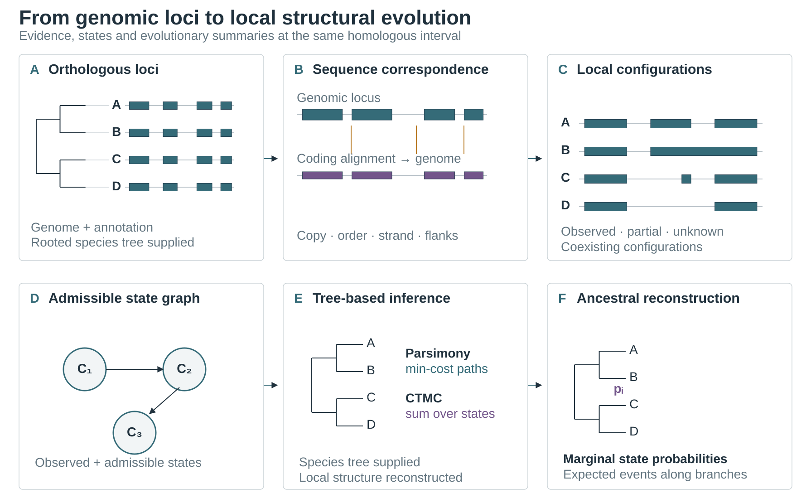
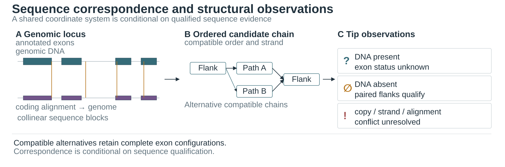
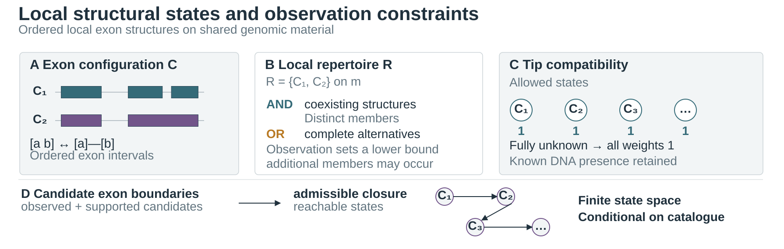
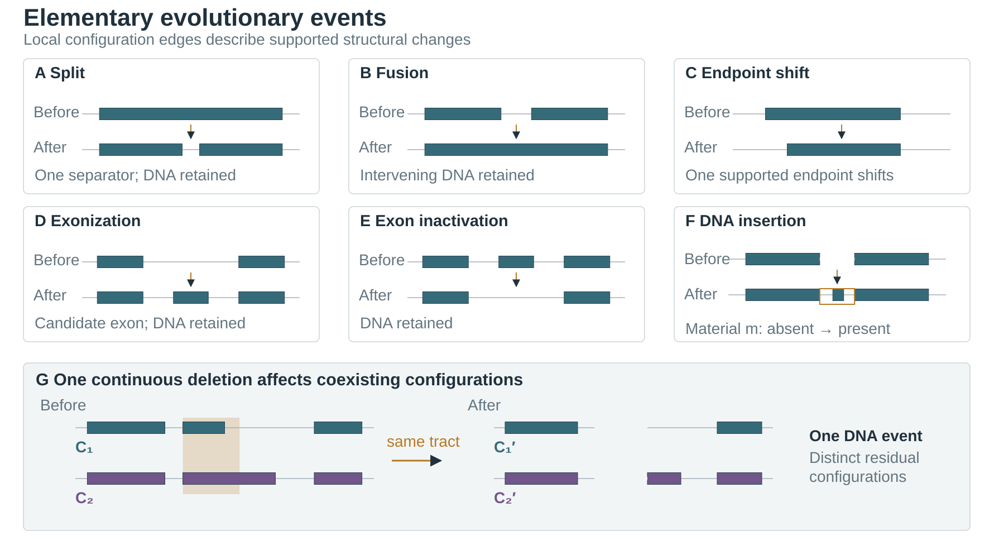
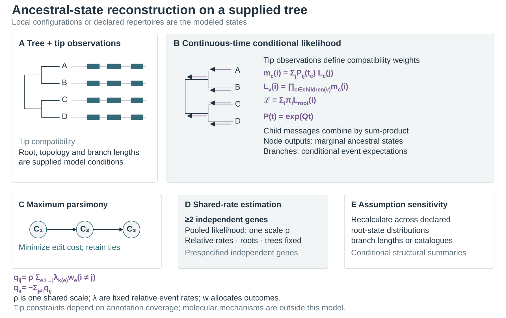

# Method schematics

These five diagrams summarize sequence correspondence, local structural states,
elementary changes and phylogenetic inference at one homologous genomic interval.
All panels are schematic. Analyses use a supplied rooted species tree; the
schematic tree represents that input. No biological estimates are plotted.

## Method scheme

Download: [SVG](figures/publication/method_scheme.svg) · [PDF](figures/publication/method_scheme.pdf) · [PNG](figures/publication/method_scheme.png)

Panels A–F show: A, orthologous loci and the supplied species tree; B, sequence
correspondence; C, local exon configurations; D, admissible configurations and
edit transitions; E, parsimony and continuous-time inference; F, marginal
ancestral-state and branch-event summaries. Qualified observations constrain
complete configurations in a finite state space defined by candidate exon
boundaries and declared edit rules.

## Exon correspondence

Download: [SVG](figures/publication/exon_correspondence.svg) · [PDF](figures/publication/exon_correspondence.pdf) · [PNG](figures/publication/exon_correspondence.png)

Collinear genomic sequence blocks and coding-alignment projections contribute
conditional evidence for interval correspondence. Compatible matches can be
joined in order; alternative paths remain explicit when copy or alignment
evidence conflicts. DNA present without informative exon annotation, qualified
DNA absence, and unresolved correspondence have distinct observation meanings.
Panel A pairs genomic and coding-projection evidence; panel B joins
order-compatible candidate matches; panel C distinguishes DNA present with
unknown exon status, flanked DNA absence, and unresolved copy or alignment
conflicts. Compatible alternatives retain complete exon configurations.

## Structural states

Download: [SVG](figures/publication/structural_states.svg) · [PDF](figures/publication/structural_states.pdf) · [PNG](figures/publication/structural_states.png)

Panel A defines `C`, an ordered configuration of non-overlapping exon intervals
on shared material `m`. Panel B defines a *local structural repertoire*
`R = {C₁, C₂}` on that material. `AND` denotes coexisting structures, which map
injectively to distinct repertoire members. `OR` denotes compatible complete
alternative configurations. Tip observations constrain a lower bound on the
repertoire; additional members may occur. Panel C shows compatibility weights:
a fully unknown tip observation has weight one for every admissible state, while
known DNA-presence constraints remain active. Panel D closes the finite state
space over declared candidate exon boundaries and admissible edits. Observation
compatibility is conditional on annotation coverage.

## Evolutionary events

Download: [SVG](figures/publication/evolutionary_events.svg) · [PDF](figures/publication/evolutionary_events.pdf) · [PNG](figures/publication/evolutionary_events.png)

Panels A–F show split, fusion, endpoint shift, exonization, annotation-conditional
inactivation and source-supported DNA insertion. Panel G shows one continuous
deletion affecting two distinct coexisting configurations. The explicit fusion
edge joins adjacent exons across retained intervening DNA. A deletion can create
exon adjacency, with the resulting merge counted once as part of the deletion
event. Event labels describe modeled structural changes; molecular mechanisms
are outside the diagram. For a declared source tract, introduction and deletion
follow the model's specified lifecycle; tip DNA absence alone does not identify
whether that tract was unintroduced or deleted.

## Phylogenetic inference

Download: [SVG](figures/publication/phylogenetic_inference.svg) · [PDF](figures/publication/phylogenetic_inference.pdf) · [PNG](figures/publication/phylogenetic_inference.png)

Panel A shows tip observations on a supplied rooted tree. Panel B shows
conditional-likelihood pruning: child messages combine across transitions and
the root likelihood sums over root states. This recursion follows [Felsenstein's
likelihood formulation](https://doi.org/10.1007/BF01734359). The generator has
off-diagonal entries $q_{ij}=\rho\sum_{e:i\to j}\lambda_{k(e)}w_e$ for $i\ne j$;
each diagonal is the negative row sum. Here $\rho$ is a shared scale, $\lambda$
are fixed relative event rates, and $w$ allocates one opportunity across its
admissible outcomes. In pruning, child $c$ contributes its conditional
likelihood across the branch of length $t_c$ to parent node $v$. The state can
be one local configuration or a declared coupled repertoire. Branch summaries
condition on $Q$, root conditions and the supplied tree.

Panel C shows minimum-edit parsimony. Panel D fits one shared scalar by pooled
likelihood over a prespecified independent-gene collection with at least two
genes; relative rates, root-state distributions and trees remain fixed, and the likelihood
pools all declared local units. Panel E recalculates summaries under declared
alternative assumptions. Tip observations impose lower-bound configuration
constraints through compatibility likelihoods conditional on supplied
annotation coverage. A transcript-detection model and ascertainment correction
are not fitted. Marginal
ancestral states summarize individual nodes. Complete
ancestral transcript repertoires, expression, exon usage, selection and molecular
repair mechanisms remain outside the model.

## Symbols and encodings

- Filled rectangles represent exons on a shared genomic-material coordinate.
- Teal and purple distinguish adjacent configurations or evidence tracks.
- Gold marks a candidate boundary or a structural edit.
- `C` denotes one ordered exon configuration; `R` denotes a set of
  configurations sharing genomic material; `m` denotes that material.
- `AND` indicates observed coexistence. `OR` indicates an unresolved choice
  among complete alternatives.
- `∅` denotes sequence-supported absence. `?` denotes unknown state
  compatibility; neither encodes a probability.
- Tree lengths and node positions are schematic and carry no numerical values.

## Export

Editable vector originals are SVG. Run
`python tools/render_method_figures.py --publication`; the default destination is
`docs/figures/publication/`. An explicit `--output-dir` is used as given. SVG
generation uses the Python standard library. Optional `--png` and `--pdf` need
CairoSVG's [`svg2png` and `svg2pdf` API](https://cairosvg.org/documentation/) in
the active environment. Missing dependencies are reported without installation.
The PDF plate width is 180 mm; PNG export is 2700 pixels wide. Alt text appears
in the figure links and each SVG has a title and description. See the [MBE author guidelines](https://academic.oup.com/mbe/pages/author-guidelines)
for figure accessibility and caption requirements.

## Further reading

These works provide context for phylogenetic likelihood, comparative analysis
and orthology inference.

- Felsenstein J. Evolutionary trees from DNA sequences: a maximum likelihood
  approach. *Journal of Molecular Evolution*. 1981;17:368–376.
  [doi:10.1007/BF01734359](https://doi.org/10.1007/BF01734359)
- Kosakovsky Pond SL, et al. HyPhy 2.5—a customizable platform for evolutionary
  hypothesis testing using phylogenies. *Molecular Biology and Evolution*.
  2020;37(1):295–299. [doi:10.1093/molbev/msz197](https://doi.org/10.1093/molbev/msz197)
- Partha R, et al. Robust Method for Detecting Convergent Shifts in Evolutionary
  rates. *Molecular Biology and Evolution*. 2019;36:1817–1830.
  [doi:10.1093/molbev/msz107](https://doi.org/10.1093/molbev/msz107)
- Kowalczyk A, Meyer WK, Partha R, Mao W, Clark NL, Chikina M. RERconverge: an R
  package for associating evolutionary rates with convergent traits.
  *Bioinformatics*. 2019;35(22):4815–4817.
  [doi:10.1093/bioinformatics/btz468](https://doi.org/10.1093/bioinformatics/btz468)
- Emms DM, Kelly S. OrthoFinder: phylogenetic orthology inference for comparative
  genomics. *Genome Biology*. 2019;20:238.
  [doi:10.1186/s13059-019-1832-y](https://doi.org/10.1186/s13059-019-1832-y)
